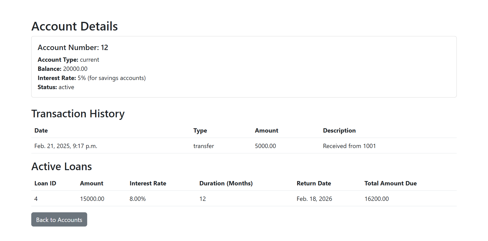

# Bank Management System

A Django-based web application for managing bank accounts, loans, and transactions.

## Features

1. **User Authentication**:
   - Signup, login, and logout functionality.
   - Password reset via email.

2. **Account Management**:
   - Create and manage bank accounts (savings, current).
   - Deposit, withdraw, and transfer money.
   - View account balance and transaction history.
   - View account details, including transaction history, active loans, and interest rate.

3. **Loan Management**:
   - Apply for loans with customizable duration and interest rate.
   - Approve or reject loans (admin only).
   - Repay loans in partial or full amounts.
   - View loan details, including repayment history and monthly interest.

4. **Interest Calculation**:
   - Automatically calculate and add interest to savings accounts daily (using Celery).

5. **Generating Reports**:
   - Generate detailed reports for transactions, loans, and account activity.

6. **Admin Panel**:
   - Manage users, accounts, loans, and transactions.
   - Approve or reject loans.
   - View detailed reports.

## Technologies Used

- **Backend**: Django (Python)
- **Frontend**: HTML, CSS, Bootstrap
- **Database**: SQLite (development), PostgreSQL (production)
- **Task Scheduling**: Celery, Redis
- **Deployment**: Heroku, AWS, or any cloud platform

## How to Run the Project

### Prerequisites

- Python 3.8+
- Redis (for Celery task scheduling)

### Installation

1. Clone the repository:
   ```bash
   git clone https://github.com/jil2004/bank_django.git
   cd bank_django
   ```

2. Create a virtual environment:
   ```bash
   python -m venv venv
   source venv/bin/activate  # On Windows: venv\Scripts\activate
   ```

3. Install dependencies:
   ```bash
   pip install -r requirements.txt
   ```

4. Apply migrations:
   ```bash
   python manage.py migrate
   ```

5. Create a superuser:
   ```bash
   python manage.py createsuperuser
   ```

6. Start the development server:
   ```bash
   python manage.py runserver
   ```

7. Start Redis (for Celery):
   - Install Redis on your system:
     - **Linux**: `sudo apt install redis`
     - **macOS**: `brew install redis`
     - **Windows**: Download Redis from [here](https://github.com/microsoftarchive/redis/releases).
   - Start the Redis server:
     ```bash
     redis-server
     ```

8. Start Celery worker and beat (for interest calculation):
   ```bash
   celery -A bankmanagementsystem worker --loglevel=info
   celery -A bankmanagementsystem beat --loglevel=info
   ```

9. Access the application at `http://127.0.0.1:8000/`.

## Generating Reports

To generate reports for transactions, loans, and account activity:

1. **Transactions Report**:
   - Go to the admin panel (`http://127.0.0.1:8000/admin/`).
   - Navigate to the **Transactions** section.
   - Use the filters to generate a report for specific accounts or time periods.

2. **Loans Report**:
   - Go to the admin panel.
   - Navigate to the **Loans** section.
   - Use the filters to generate a report for approved, pending, or rejected loans.

## Screenshots

- **User Homepage**: 
- **Admin Dashboard**: 
- **Loan Details**: 
- **Account Details**: 

## Contributing

Contributions are welcome! Please open an issue or submit a pull request.


---